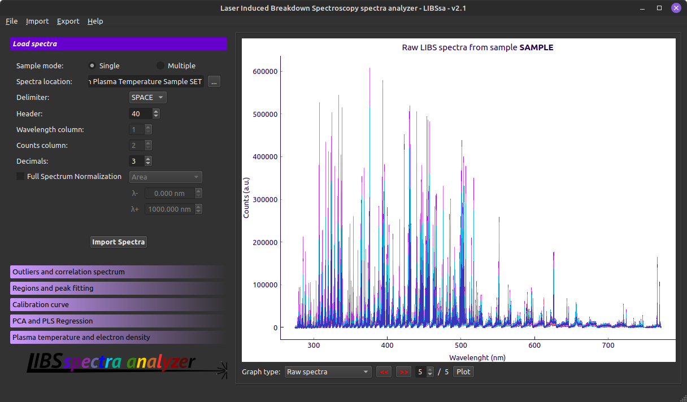
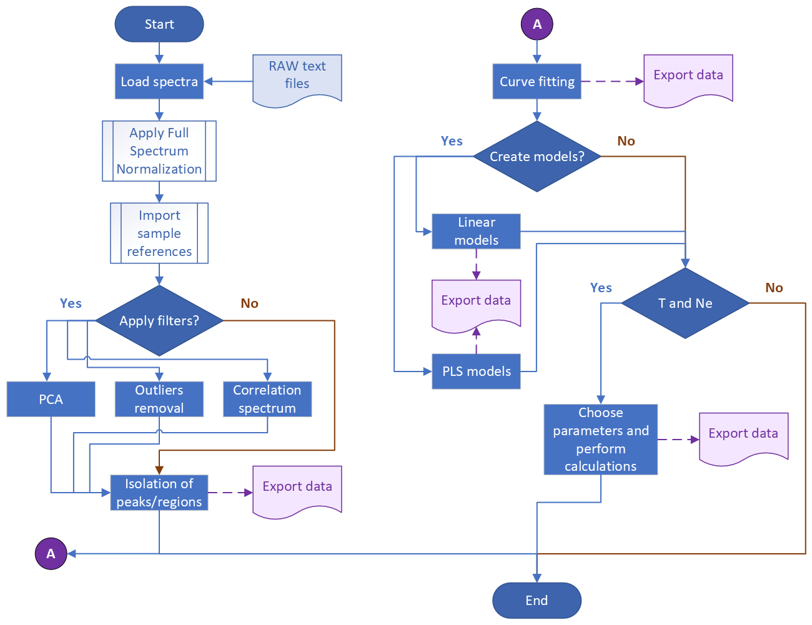

# Summary

Laser-Induced Breakdown Spectroscopy (LIBS) is a technique that uses a high-energy pulsed laser to detect and analyze
elements present in a sample. The laser beam is directed through an optical system (commonly mirrors, lenses, prisms,
or optical fibers) and focused onto the sample's surface. When the laser interacts with the sample, a part is ablated,
vaporized, and generates a high-temperature plasma. The species in the plasma emit electromagnetic radiation characteristics
of each element in the sample. This radiation is collected by lenses and conveyed through an optical fiber to a spectrometer,
where diffraction occurs. The diffracted light is detected using a CCD (charge-coupled device) or ICCD (intensified charge-coupled device).
Finally, a spectrum (\autoref{fig:1}) is generated [@miziolek2006laser].

Due to its advantages, the LIBS technique has been widely used for elemental characterization in several types of samples,
including soils [@ferreira2011evaluation; @nicolodelli2014quantification; @villas2016laser; @stenio2022carbon], 
leaves [@ranulfi2018nutritional; @stenio2022direct], fertilizers [@marangoni2016phosphorus], river sediments [@de2021total],
food [@costa2018direct], metallic alloys [@noll2018libs] and electronic waste [@costa2018laser], to name a few.

The Laser-Induced Breakdown Spectroscopy spectra analyzer (**LIBSsa**) is open-source software written in Python focused on
analyzing LIBS spectra. It combines multiple tools used in LIBS analysis into only one application, such as outliers removal,
isolation of spectral lines, curve fitting, linear models (calibration curves), principal components analysis (PCA),
and plasma temperature and electron density calculation.

.\label{fig:2}](./pic/libssa.svg)

# Statement of need

LIBS measurement is much simpler than other standard elementary characterization techniques, such as Flame Absorption Atomic Spectrometry
(FAAS) or ICP (Inductively Coupled Plasma), since it does not require acid digestion for sample preparation. Furthermore, the user
can obtain a sample spectrum in seconds. Nonetheless, the analysis of its signal may be highly complex.

Much of the complexity in analyzing LIBS spectra arises mainly due to matrix effects, which hinder the ability to obtain
calibration blanks and generate universal calibration curves. As a result, analysts need to adopt various calibration and
signal-processing strategies to achieve quantitative measurements.

In general, those working with LIBS commonly develop tools to process the measured signal and extract satisfactory results.
However, this practice has the effect of generating highly specialized users of the technique, not only in terms of using
instrumentation but also in scientific data analysis tools, such as [R](https://www.r-project.org/), [MATLAB](https://www.mathworks.com/products/matlab.html),
[OriginLab](https://www.originlab.com/), [Weka](https://www.cs.waikato.ac.nz/ml/weka/), among others. Although these software
are powerful tools for signal analysis, they are not dedicated tools for LIBS spectra analysis.

Knowing about these challenges and aiming to make the LIBS technique more widely used, the authors [@kstenio2023] proposed a
software creation that would automate the LIBS analysis, incorporating strategies used in several works in the literature
[@marangoni2016phosphorus; @nicolodelli2014quantification; @de2021total; @stenio2022carbon; @castro2016twelve; @stenio2022direct].
In this way, the LIBSsa software was conceived (\autoref{fig:3}).

The main purpose of LIBSsa is to help scientists in LIBS/spectroscopy field gain speed and practicality when analyzing LIBS
spectra, allowing fast assessment of which is the best calibration strategy for the sample set.

# Brief software description

LIBSsa is straightforward: the user selects the input source (where LIBS spectra are located), loads them into the program, and 
does a wide range of treatments, including: removal of outliers using SAM [@keshava2004distance] or MAD [@leys2013detecting] algorithms,
full spectrum normalization (FSN), correlation spectrum, peak isolation, peak fitting (Gaussian, Lorentzian and Voigt), univariate
linear models, multivariate partial least squares regression (PLSR), principal components analysis (PCA), and plasma temperature
and electron density calculation using Saha-Boltzmann equation [@kstenio2023]. \autoref{fig:4} shows some of the graphics
generated by LIBSsa.

In each step of the analysis, it is possible to save/export data into multiple file formats (txt, csv and xlsx). \autoref{fig:5} shows
a usual workflow of LIBSsa analysis.

In order to properly operates, the program uses the libraries **NumPy** [@harris2020array] and **SciPy** [@virtanen2020scipy] 
for most calculations, **pandas** [@mckinney2010data] and **openpyxl** [@openpyxl2023v312] to export spreadsheets, 
**scikit-learn** [@pedregosa2011scikit] to do linear, PLS and PCA models, **pyqtgraph** [@pyqtgraph2023v0133] to show in
program graphics, and finally **PySide6** [@pyside62023v643] as the graphical user interface (GUI) framework.

# Author contributions

Conceptualization: K. S., D. M. B. P. M.; data curation: K. S.; formal analysis: K. S.; funding acquisition: D. M. B. P. M.;
investigation: K. S.; methodology: K. S.; project administration: K. S.; resources: D. M. B. P. M.; software: K. S.; supervision: D. M. B. P. M.;
validation: K. S., D. M. B. P. M.; visualization: K. S.; writing – original draft: K. S.; writing – review & editing: K. S., D. M. B. P. M..

# Conflicts of interest

There are no conflicts to declare.

# Acknowledgments

The development of LIBSsa software (up to version 2.0.99) was supported by the Coordination for the Improvement of Higher 
Education Personnel - Brazil (CAPES) - Finance Code 001 and by Embrapa Instrumentation.

# References